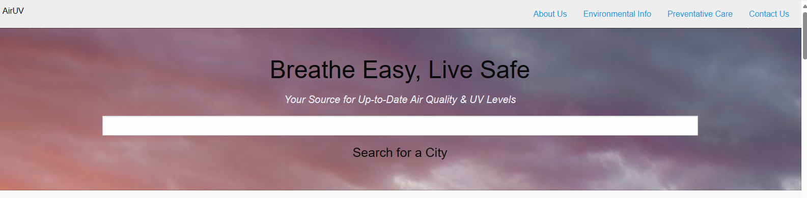
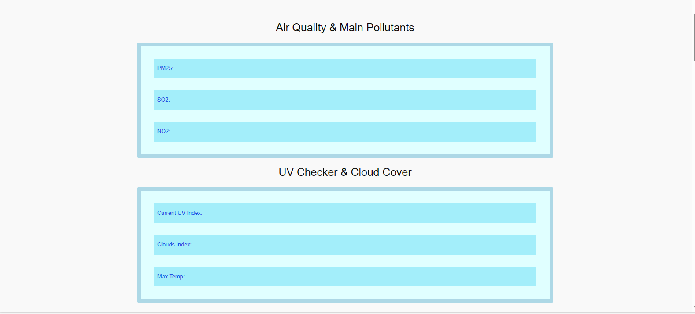
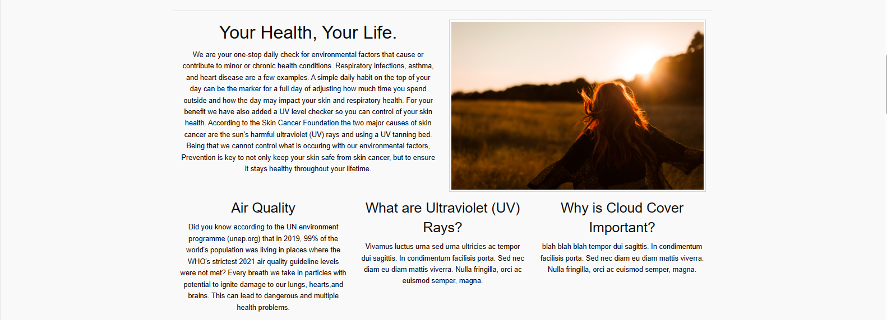
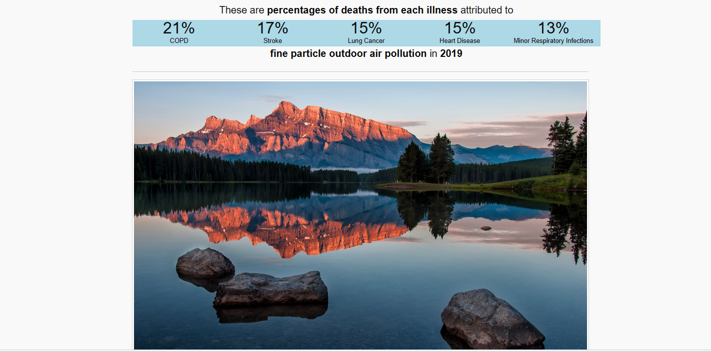
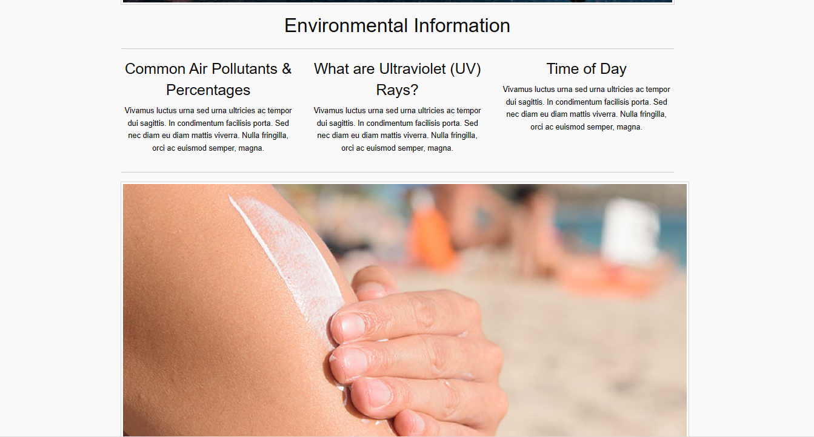
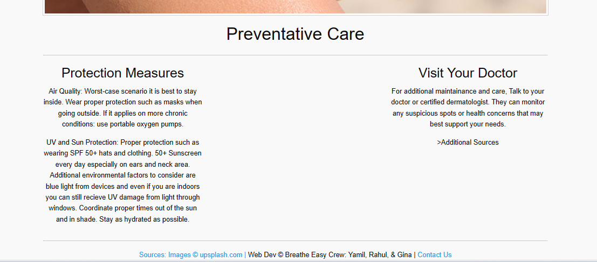

# Dream-Team-Project
A Gina Bauza, Rahul Sharma &amp; Yamil Hernandex Collaboration

## Description & Goal

Imagine having real-time access to the air you breathe and the UV levels around you, empowering you to make healthier choices every day. That's exactly what our Air Quality and UV Index website offers. With our platform, you'll effortlessly check the air quality and UV index in your area, helping you plan outdoor activities, protect your skin, and safeguard your health.

Our project aims to develop a comprehensive online platform that provides users with real-time information on air quality and UV index levels in their area. By aggregating data from reliable sources and utilizing algorithms, our website offers accurate and up-to-date insights to help users make informed decisions about their outdoor activities and health precautions. Whether it's planning a jog, deciding on outdoor dining, or simply protecting oneself from harmful UV rays, our platform equips users with the knowledge they need to stay safe and healthy. Our ultimate goal is to promote environmental awareness and empower individuals to take proactive steps towards better air quality and sun protection.

## User Story 
As a User, I want an online platform that provides real-time information on air quality and UV Index levels so that I can promote awareness toward better health precautions and safety.

## Results 

## Links 
Deployed website 
Repository website: AirUV.com

## Usage

All materials should be present with the repository

## Credits

## License 

MIT License 

## Badges 

## Features 

 *GitHub
 *HTML & CSS
 *JQuery & BootStrap
 *Air Quality Programmatic APIs
 *Open Weather Programmatic APIs

HTML, Advanced CSS, JQuery, Bootstarp all utilized within UI 

## Tests